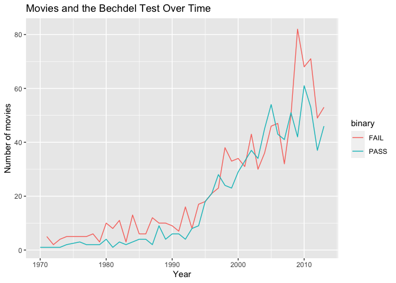

How Many Movies Pass the Bechdel Test Each Year?
================

Based on data from
[**FiveThirtyEight.**](https://fivethirtyeight.com/features/the-dollar-and-cents-case-against-hollywoods-exclusion-of-women/)

Named for the cartoonist Alison Bechdel, the Bechdel Test is a measure
of the representation of women in media. In order for a film to pass the
test, Bechdel had three criteria: 1) there must be at least two named
women in the film, 2) they must have a conversation with each other at
some point, and 3) that conversation can’t be about a male character.

This data set analyzes 1,794 films released between 1970 and 2013.

<!-- -->
